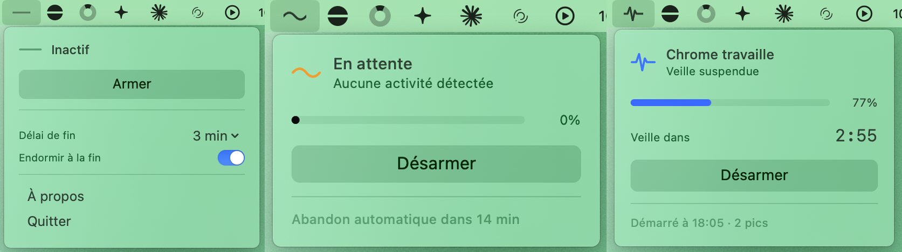

# ClaudeAwake

Garde le Mac éveillé pendant les tâches Claude in Chrome, et l'endort quand c'est fini



## Installation

[**Télécharger la dernière version**](https://github.com/arthur-olivier/ClaudeAwake/releases/latest/download/ClaudeAwake.app.zip)

Décompressez, glissez dans Applications, lancez.

À savoir que l'app n'est pas signée, donc elle sera marquée comme endommagée.

## Utilisation

**1. Avant de lancer votre tâche**, cliquez sur l'icône puis sur **Armer**.

**2. Lancez votre tâche** Claude qui utilise Claude in Chrome.

**3. Partez.** Votre Mac ne s'endormira plus tant que cette tâche travaille.

**4. Quand tout est fini**, votre Mac s'endort tout seul.

### Comment savoir où ça en est

L'icône en haut de l'écran change de forme. Un coup d'œil suffit :

**Un trait plat** — l'app ne fait rien. Votre Mac s'endort normalement, comme
d'habitude.

**Une petite vague** — vous avez armé, l'app attend que Chrome (plus précisement que votre tâche Claude avec Claude in Chrome) se mette à
travailler. Si vous armez, que vous n'utilisez pas Chrome et que vous changez d'avis, elle s'arrête d'elle-même
au bout d'un quart d'heure.

**Un tracé de cardiogramme** — Chrome travaille. Votre Mac reste éveillé, et un
compte à rebours s'affiche à côté de l'icône.

### Le compte à rebours

Il indique dans combien de temps votre Mac s'endormira **si Claude/Chrome ne fait plus
rien**.

Vous le verrez souvent remonter à sa valeur maximale : c'est bon signe, ça veut
dire que l'activité continue. Il ne descend jusqu'à zéro que quand tout est
réellement calme, et c'est à ce moment que la mise en veille se déclenche.

### Les deux réglages

Cliquez sur l'icône quand l'app est au repos, vous verrez :

**Délai de fin** — combien de temps de calme complet avant de considérer que
c'est fini. Trois minutes conviennent presque toujours. Si votre Mac s'endort
alors que la tâche n'était pas terminée, mettez cinq ou dix minutes.

**Endormir à la fin** — désactivez-le pour vos premiers essais. L'app vous
montrera tout ce qu'elle détecte sans jamais endormir la machine, ce qui permet
de comprendre son fonctionnement tranquillement. Réactivez-le ensuite.

## Ce que ça ne fait pas

L'app regarde l'activité de Chrome, pas Claude lui-même. Si vous lancez une vidéo
pendant que c'est armé, elle croira que ça travaille. Ça ne m'a jamais gêné en
usage réel, mais c'est une vraie limite.

## Compiler

```bash
git clone https://github.com/arthur-olivier/ClaudeAwake.git
cd ClaudeAwake && open ClaudeAwake.xcodeproj
```

## Licence

MIT
